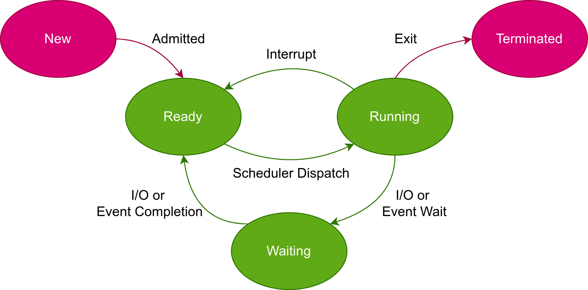

# CPU Scheduling Algorithms
This project was designed by the TA team for the Operating Systems course (Fall 2021).

## Description
The goal of this project is to implement the following scheduling algorithms:

* **FirstComeFirstServed (FCFS)**

* **RoundRobin (RR)**, with time quantum: 5ms.

* **ShortestJobFirst (SJF)**

* **MultiLevelFeedbackQueue (MLFQ)**
    * **First queue:** RoundRobin time Quantum 8 ms.
    * **Second queue:** RoundRobin with time Quantum 16 ms.
    * **Third queue:** FirstComeFirstServed.

Each process has five attributes:
- **ID**
- **Arrival Time**
- **First Burst Time**
- **IO Time**
- **Second Burst Time**

At the end, results should be analysed providing information such as waiting time, 
response time, turn around time, cpu utilization, etc.

**Note:** Test case are also provided in [*"process_inputs.csv"*](https://github.com/arlotfi79/OperatingSystems-Fall2021/blob/main/process_inputs.csv)   to check the results.
## Implementation
The overall schema of a CPU scheduler is given below. 
Regarding this schema we have implemented all algorithms and have illustrated the results using a table.

Since there are five stages for CPU scheduling as shown below, we have used a Queue for each stage to mitigate 
dealing with changing the state of each process.

